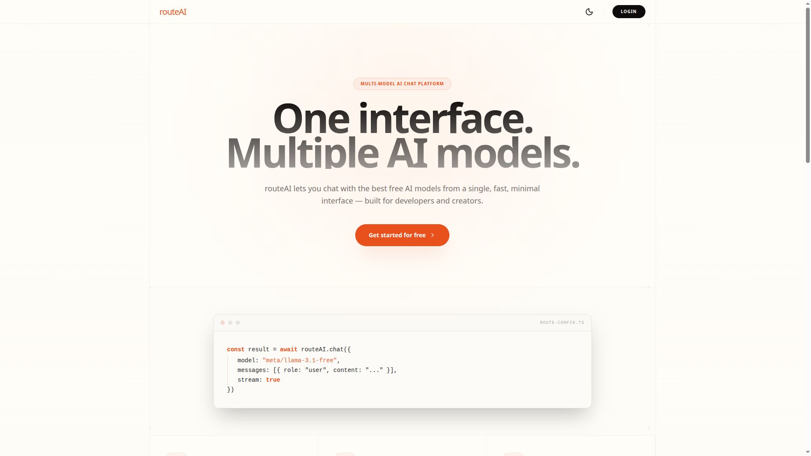

# RouteAI — Multi-Model AI Chat Platform

RouteAI is a modern AI chat application built with Next.js, providing seamless access to 50+ free AI models through OpenRouter integration. It allows users to interact with multiple AI models from a unified interface, upload files and images, and manage conversation history—all with a clean, distraction-free design.

## Features

- 🤖 Access 50+ free AI models from OpenAI, Anthropic, Google, Meta, and more
- 💬 Unified chat interface with real-time streaming responses
- 🔄 Switch between models seamlessly without losing conversation context
- 🔐 Secure authentication with GitHub/Google via BetterAuth
- 💾 Persistent conversation history and management
- 🌙 Dark mode support for comfortable viewing
- ⚡ Fast, minimal UI focused on productivity

## Tech Stack

- [Next.js App Router](https://nextjs.org/docs/app) 16.0.10 with React 19.2.1
- [TypeScript](https://www.typescriptlang.org/) for type safety
- [Vercel AI SDK](https://sdk.vercel.ai/) (`ai`, `@ai-sdk/react`) for AI interactions
- [OpenRouter AI SDK Provider](https://www.npmjs.com/package/@openrouter/ai-sdk-provider) for multi-model support
- [Prisma ORM](https://www.prisma.io/) with PostgreSQL
- [BetterAuth](https://www.betterauth.dev/) for authentication
- [Zustand](https://zustand-demo.vercel.app/) for state management
- [TanStack Query](https://tanstack.com/query/latest) for server state
- [Tailwind CSS](https://tailwindcss.com/) v4 for styling
- [Radix UI](https://www.radix-ui.com/) & [Shadcn/ui](https://ui.shadcn.com/) for components
- [Lucide React](https://lucide.dev/) for icons

## Getting Started

### 1. Install dependencies

```bash
npm install
```

### 2. Set up environment variables

Create a `.env` file in the root with your database, authentication, and OpenRouter credentials. Example:

```
NODE_ENV=development
DATABASE_URL=postgresql://...
NEXTAUTH_URL=http://localhost:3000
AUTH_GITHUB_ID=...
AUTH_GITHUB_SECRET=...
AUTH_GOOGLE_ID=...
AUTH_GOOGLE_SECRET=...
AUTH_SECRET=...
OPENROUTER_API_KEY=...
```

### 3. Set up the database

Run Prisma migrations:

```bash
npx prisma migrate dev
```

### 4. Start the development server

```bash
npm run dev
```

Open [http://localhost:3000](http://localhost:3000) in your browser.

## Use Cases

- **Model Comparison**: Test prompts across different AI models to find the best fit
- **Development**: Rapidly prototype AI features without managing multiple API keys
- **Research**: Explore capabilities of various models in one unified interface
- **Productivity**: Get work done with a fast, distraction-free chat experience
- **Learning**: Experiment with cutting-edge AI models for free

## Contributing

1. Fork the repository
2. Create a feature branch (`git checkout -b feature/amazing-feature`)
3. Commit your changes (`git commit -m 'Add amazing feature'`)
4. Push to the branch (`git push origin feature/amazing-feature`)
5. Open a Pull Request

## Contact

Feel free to reach out if you have any questions!

- **Portfolio** : [askvishal.in](https://askvishal.in/)
- **GitHub**: [rajput-vishal01](https://github.com/rajput-vishal01)
- **Email**: [askvishal.me@gmail.com](mailto:askvishal.me@gmail.com)
